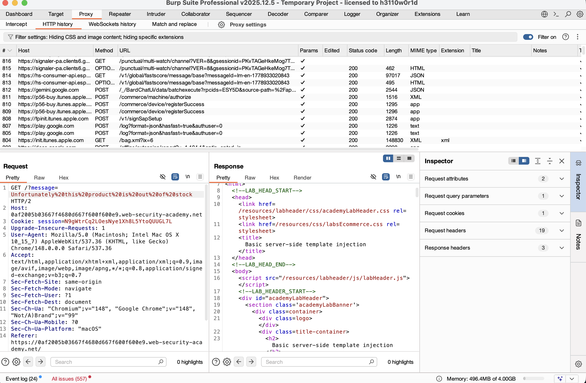
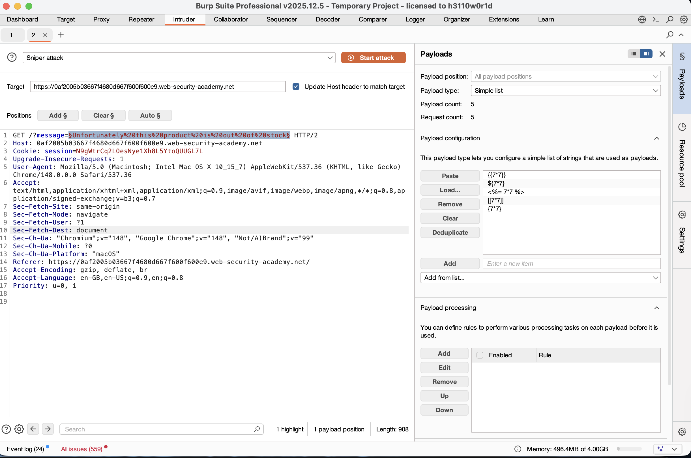
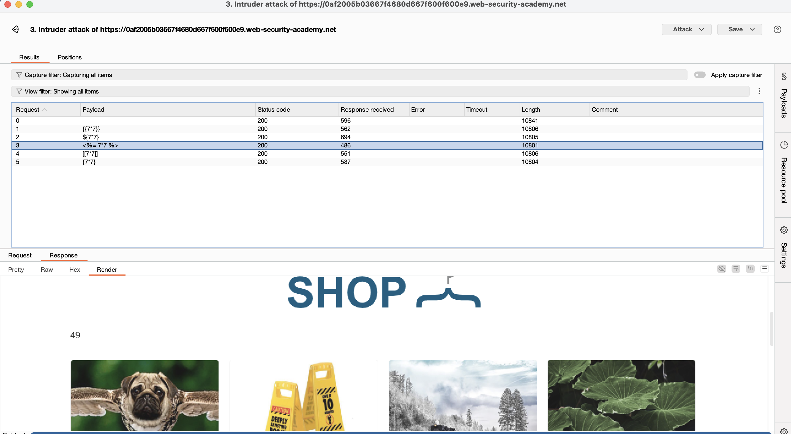
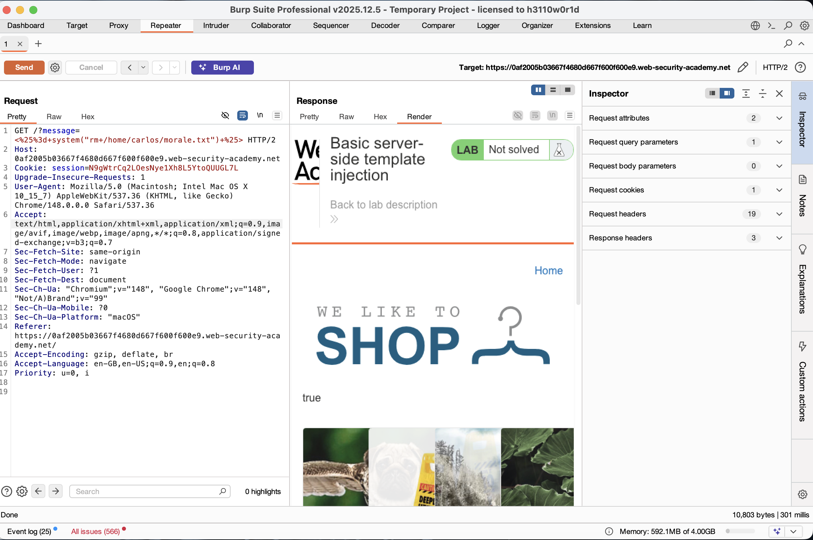
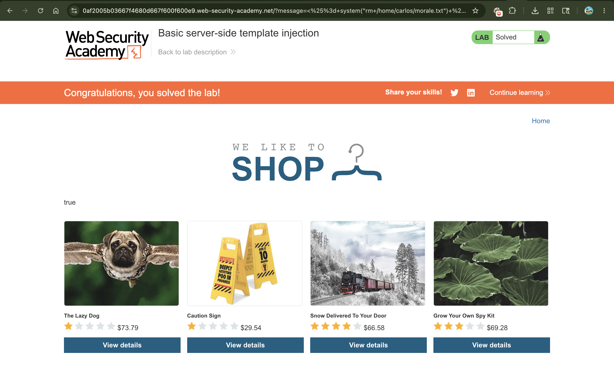

# Exploiting Basic Server-Side Template Injection (SSTI)

## 📌 Summary

The application is vulnerable to **Server-Side Template Injection (SSTI)** because it safely embeds user input into a dynamic server-side template (Ruby ERB). By injecting specialized template code, an attacker can trick the server into executing arbitrary operating system commands, leading to complete control over the application's hosting environment.

---

## 🧾 Description

Server-Side Template Injection occurs when user input is concatenated directly into a template instead of being handled as safe data. The application uses **ERB (Embedded Ruby)**, which supports code execution via the `<%= ... %>` or `<% ... %>` syntax.

By passing malicious template payloads into the `message` parameter, the template engine processes the expression on the server. This allows an attacker to transition from simple mathematical evaluations to executing system-level commands (Remote Code Execution) using Ruby's built-in `system()` method.

---

## 🔁 Steps to Reproduce

1. Browse the website and click on a product to notice that a `message` parameter is used in the URL to display alerts on the screen:
```text
GET /?message=Unfortunately%20this%20product%20is%20out%20of%20stock

```


2. Intercept this request using **Burp Suite** and send it to **Intruder** to test for Template Injection.
3. Set up a fuzzing list of common template expressions to identify the engine:
* `{{7*7}}`
* `${7*7}`
* `<%= 7*7 %>`
* `[[7*7]]`


4. Run the Intruder attack. Observe that the payload `<%= 7*7 %>` successfully executes on the server, returning the mathematical result **49** in the HTML response. This confirms the template engine is **Ruby ERB**.
5. Send the request to **Repeater** to craft the final payload.
6. Use Ruby's `system()` function to execute a system command that removes the target file from Carlos's directory:
```ruby
<%= system("rm /home/carlos/morale.txt") %>

```


7. URL-encode the final payload to ensure proper delivery:
```text
/?message=<%25+system("rm+/home/carlos/morale.txt")+%25>

```


8. Send the request via Burp Repeater or paste it into the browser to trigger the command and delete the file.

---

## 📸 Proof of Concept (PoC)

1. Intercepting the vulnerable message request


1. Sending test payloads to Burp Intruder


2. Brute forcing payloads to identify the ERB engine evaluation (Result: 49)


3. Executing the final exploit payload via Repeater


4. Lab solved successfully



---

## 💥 Impact

* **Remote Code Execution (RCE)** Attackers can run arbitrary operating system commands directly on the host server.
* **Data Destruction & Theft** Sensitive files can be modified, read, or permanently deleted (as demonstrated with `morale.txt`).
* **Server Takeover** An attacker can potentially pivot into the internal network, download malware, or fully compromise the underlying infrastructure.

---

## 🛠️ Remediation

To secure the application against template injection:

* **Avoid Direct User Input in Templates** Never pass raw, unvalidated user input directly into template layout strings. Treat user input strictly as data, not executable template code.
* **Use Built-in Passing Parameters** If data needs to be displayed, pass it safely to the template engine via context variables rather than compiling code dynamically.
* **Implement Input Sanitization** Apply strict allow-lists to any parameters accepted by the application, stripping away dangerous character sequences like `<%` and `%>`.