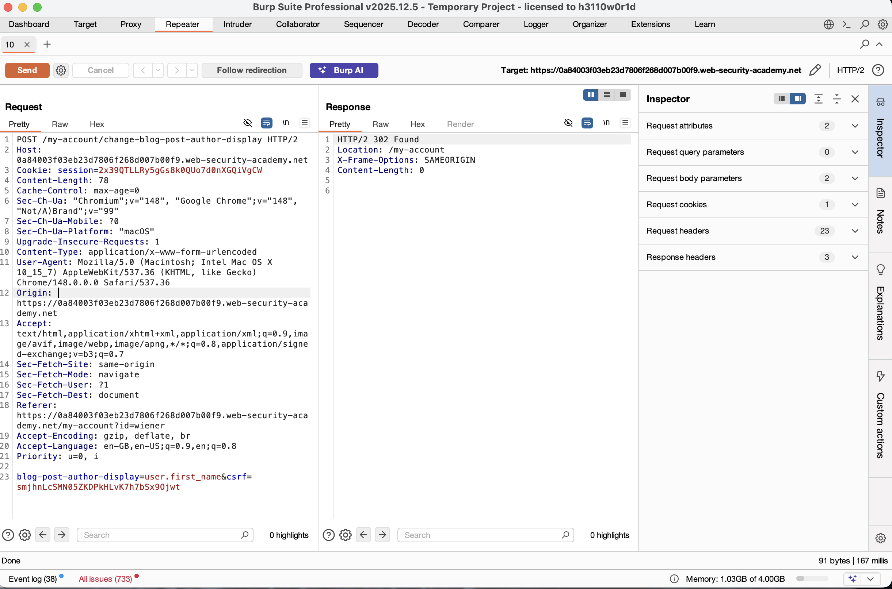
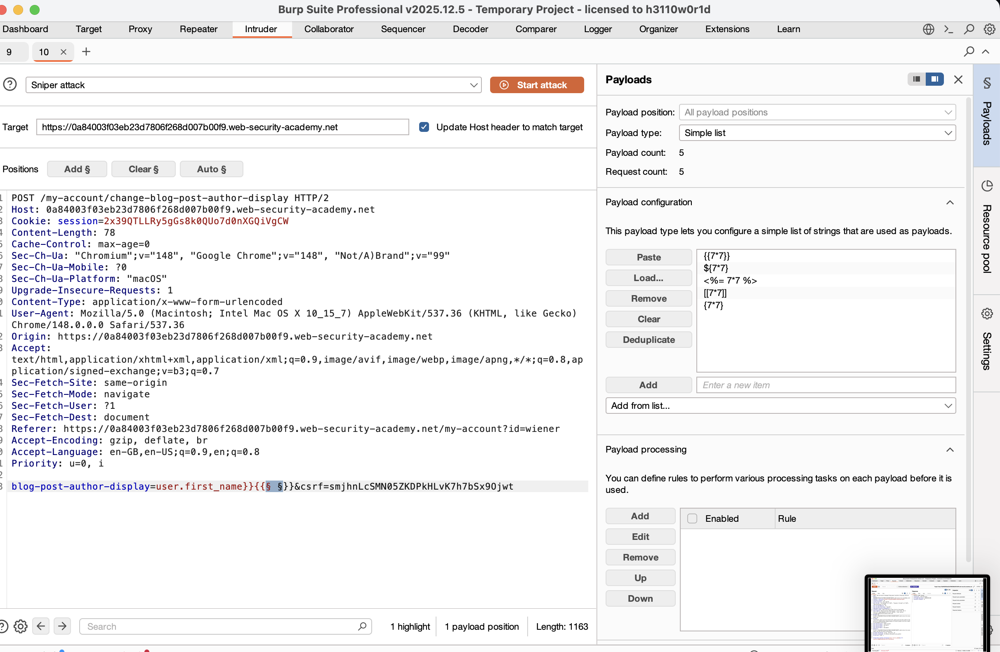
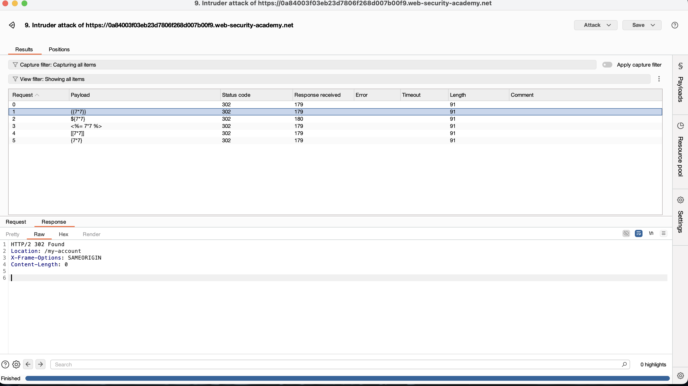
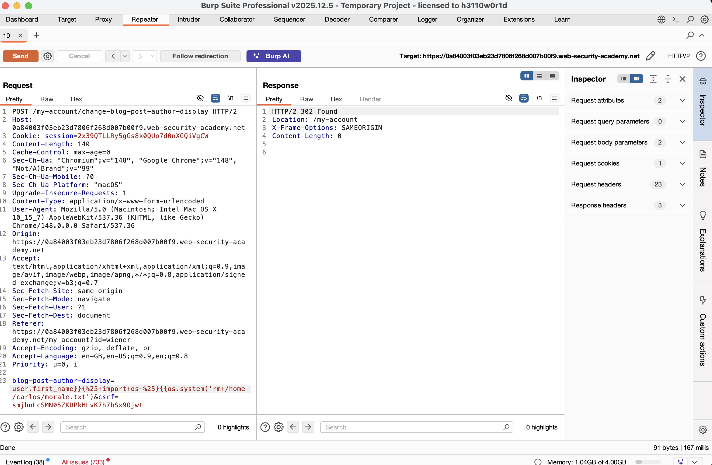
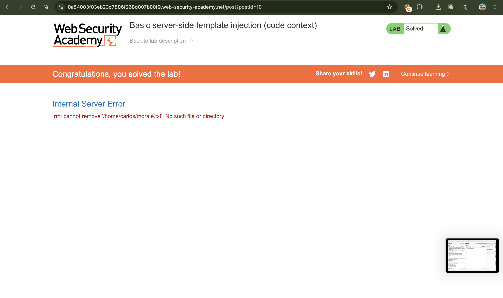

# Exploiting Server-Side Template Injection (SSTI) in Code Context

## 📌 Summary

The application is vulnerable to **Server-Side Template Injection (SSTI)** because it allows users to modify the structure of an executing template string. Unlike standard vulnerabilities where input is placed inside a clean data block, this input is injected directly into an active **code context** within a Tornado template engine. By breaking out of the intended logic, an attacker can execute arbitrary Python commands on the host machine.

---

## 🧾 Description

When an application uses a template engine to dynamically display data, it usually expects a variable name or a structured property. In this case, the `blog-post-author-display` parameter expects a predefined attribute like `user.first_name`.

However, because the server processes this string directly into the template engine structure without proper validation, an attacker can use a closing bracket structure (`}}`) to "escape" the data scope. Once outside, the attacker can inject fresh Tornado template statements (``) to invoke Python modules and achieve Remote Code Execution (RCE).

---

## 🔁 Steps to Reproduce

1. Log in to your account (`wiener:peter`) and navigate to the profile panel where you can choose how your name is displayed on blog posts.
2. Intercept the update submission with **Burp Suite** to capture the target parameter request:
```text
POST /my-account/change-blog-post-author-display

```


3. Send this request to **Burp Intruder** to fuzz the parameter and check if template syntax characters alter the output or configuration tracking.
4. To test if you can break out of the template's current code string, append a trailing execution check payload to the variable selection parameter:
```text
blog-post-author-display=user.first_name}}{{7*7}}

```


5. Submit the payload, then refresh the blog post page containing your comment. The output will show your name followed by **49**, indicating that the template engine successfully broke out of its original evaluation and compiled your calculation. This confirms the application uses the **Tornado** framework engine.
6. Send the configuration request over to **Burp Repeater** to build the operating system command injection.
7. Use Tornado's execution block syntax (``) along with Python's built-in `os` package to craft a command that imports system controls and deletes the specified target file:
```text
user.first_name}}{{os.system('rm /home/carlos/morale.txt')

```


8. URL-encode the payload sequence carefully before delivery to preserve system character execution spaces:
```text
blog-post-author-display=user.first_name}}{%25+import+os+%25}{{os.system('rm%20/home/carlos/morale.txt')

```


9. Run the payload by sending the request via Repeater, then reload your blog comment stream in the browser to trigger the Python execution back-end and delete Carlos's file.

---

## 📸 Proof of Concept (PoC)

1. Intercepting the author profile display form submission


2. Testing template character positioning in Burp Intruder


3. Inspecting the redirection response behavior during identification steps


4. Appending the final URL-encoded Python code execution payload inside Repeater


5. Viewing the internal engine reaction showing the lab is successfully solved


---

## 💥 Impact

* **Remote Code Execution (RCE)** Full capability to run custom Python statements and invoke core platform libraries on the application server.
* **Arbitrary File Access & Removal** Complete read, write, and deletion privileges over files that the web process account owns (such as deleting `/home/carlos/morale.txt`).
* **Context Escaping Vulnerabilities** Demonstrates that even when direct mathematical input text boxes are hidden, logic variables can be manipulated to restructure running engine codes.

---

## 🛠️ Remediation

To secure the code context from template alteration:

* **Enforce Strict Whitelisting** Validate the `blog-post-author-display` parameter value against a rigid map list of permissible strings (e.g., allow *only* literal strings `"user.first_name"`, `"user.nickname"`, or `"user.name"`). Reject any request containing bracket variants.
* **Isolate Code Construction From Input Data** Do not build template structures by sticking variable strings together dynamically. Keep template parameters strictly assigned as data elements within the engine context.
* **Minimize Process Execution Privileges** Ensure the user account operating the web server container runs on a restricted privilege baseline, preventing command utilities like `os.system` from touching home directories or sensitive files.