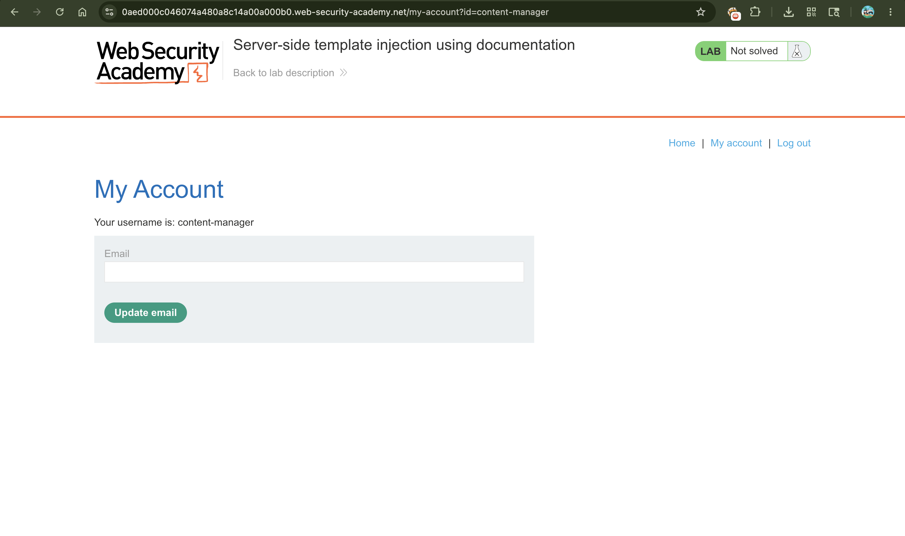
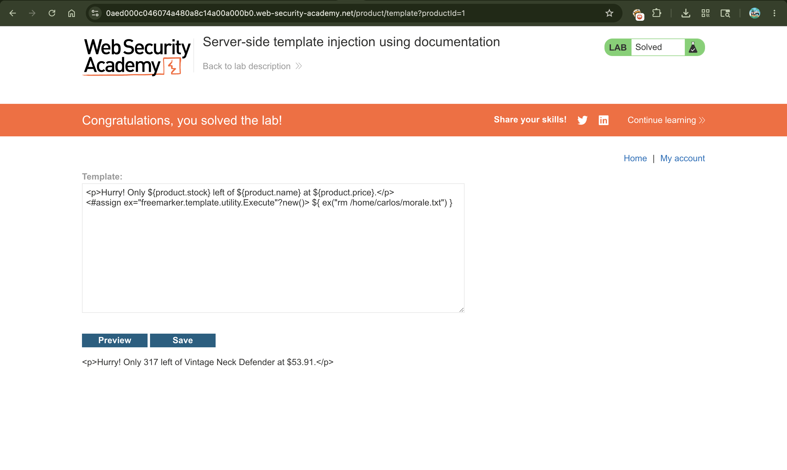

# Exploiting Server-Side Template Injection (SSTI) Using Documentation

## 📌 Summary

The application is vulnerable to **Server-Side Template Injection (SSTI)** because it allows privileged users to edit product description templates directly. By identifying the underlying template engine through error logs, an attacker can use official documentation to find dangerous built-in features, instantiate malicious objects, and execute arbitrary operating system commands.

---

## 🧾 Description

When applications allow users to customize layouts using template syntaxes, they must restrict access to dangerous framework utilities. In this lab, the application exposes a template editing interface for product descriptions.

By submitting an invalid variable or syntax error, the server leaks detailed debugging information that reveals it is running the **Apache FreeMarker** engine. A review of the FreeMarker security documentation reveals that the `?new()` built-in method can be used to instantiate arbitrary Java classes. By targeting the `freemarker.template.utility.Execute` class, an attacker can pass operating system commands directly to the server backend.

---

## 🔁 Steps to Reproduce

1. Log in to the application using the provided credentials:
```text
content-manager:C0nt3ntM4n4g3r

```


2. Go to any product page, click **Edit template**, and look at the syntax. It uses the `${someExpression}` format to render data.
3. Force an error to identify the template engine by injecting a non-existent variable name into the template field:
```text
${foobar}

```


4. Click **Save** and look at the output message. The detailed debug stack trace explicitly states that a **FreeMarker template error** occurred, revealing the exact template engine in use.
5. Review the FreeMarker documentation regarding template safety. The documentation notes that the `?new()` built-in can instantiate classes implementing `TemplateModel`, such as the `Execute` utility class which runs shell commands.
6. Construct the exploit payload using FreeMarker's assign directive (`<#assign>`) to instantiate the execution utility and call the deletion command:
```text
<#assign ex="freemarker.template.utility.Execute"?new()> ${ ex("rm /home/carlos/morale.txt") }

```


7. Replace your previous test input inside the template editor with this new malicious payload and click **Save**.
8. Refresh or view the modified product description page to trigger the template rendering, which executes the shell command and deletes Carlos's file.

---

## 📸 Proof of Concept (PoC)

1. Logging into the application with the content manager account


2. Injecting an invalid variable (`${foobar}`) to discover the template engine type via error leakage


3. Saving the final FreeMarker command execution payload inside the template box to solve the lab


---

## 💥 Impact

* **Remote Code Execution (RCE)** Attackers can execute arbitrary commands with the privileges of the underlying web server user.
* **Full Server Takeover** Access to system utilities allows attackers to read sensitive configuration files, modify application data, or pivot onto internal networks.
* **Severe Data Loss** Files can be deleted or overwritten permanently, as shown by removing `morale.txt`.

---

## 🛠️ Remediation

To secure the template customization features:

* **Avoid User-Facing Template Editing** Do not allow untrusted or low-privileged users to edit raw template code directly. Use static forms or restrictive drop-down configurations instead.
* **Implement a Strict Class Restrictions Policy** If FreeMarker templates must be user-editable, configure the `TemplateClassResolver` to use `ALLOWS_NOTHING_RESOLVER` or restrict dangerous utilities like `Execute` and `ObjectConstructor`.
* **Turn Off Verbose Error Reporting** Disable detailed error reporting and debug logs in production environments to prevent attackers from discovering back-end framework specifications.